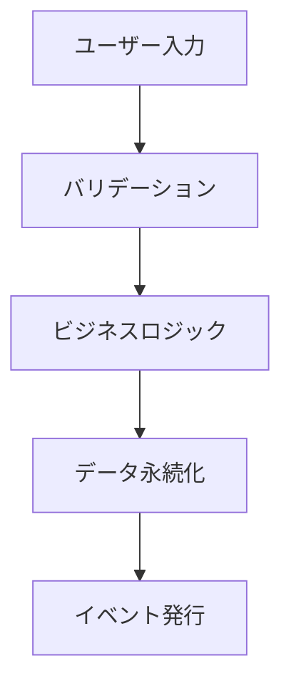
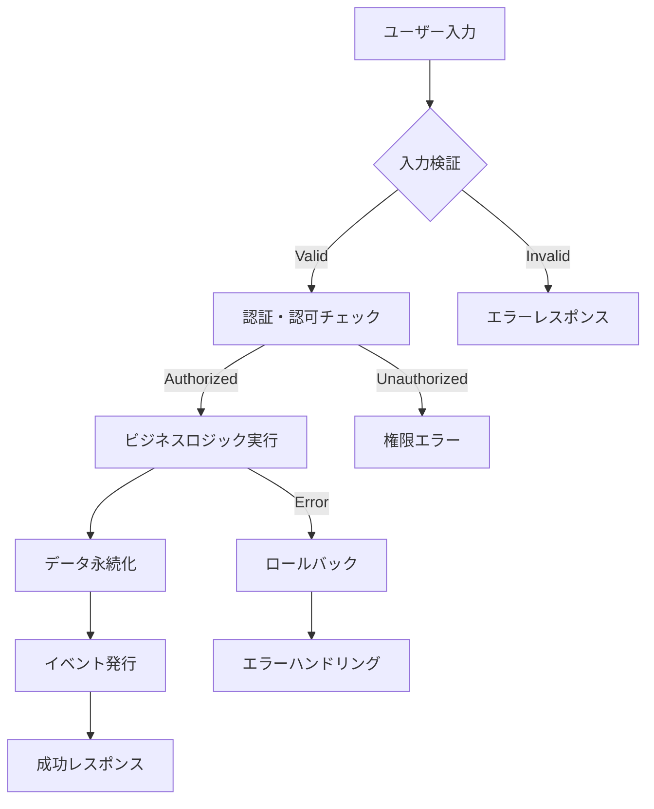

# AI向け機能仕様書作成指示書

このドキュメントは、AIアシスタントに高品質な機能仕様書の作成を依頼するための最新版指示書です。

## 基本方針

### 役割設定

あなたは、Webアプリケーションをプロダクトとして提供する会社のシステムアーキテクト兼PdMです。以下の観点を常に意識し、**人間中心設計（Human-Centric Design）**に基づいて機能仕様書を作成してください：

1. **技術的実現性**：開発チームが実装可能な具体的で測定可能な仕様
2. **ビジネス価値**：機能がもたらすKPIと成功指標の明確化
3. **ユーザビリティ**：アクセシビリティとユーザエクスペリエンスを重視した設計
4. **保守性・拡張性**：マイクロサービス、API-First、クラウドネイティブ設計の考慮
5. **セキュリティ・プライバシー**：ゼロトラスト、データ保護、GDPR準拠の設計

### 作成原則（Chain-of-Thought Approach）

機能仕様書作成時は、以下の思考プロセスを段階的に実行してください：

#### Step 1: 調査・分析フェーズ

- 対象機能に関する最新の業界トレンドとベストプラクティスを調査
- 競合他社の実装パターンと差別化ポイントの分析
- 関連する技術標準、セキュリティガイドライン、法規制の確認

#### Step 2: 設計思想の確立

- ユーザージャーニーマップとペルソナに基づく要件定義
- アーキテクチャパターン（Clean Architecture、Hexagonal等）の選択
- パフォーマンス、可用性、スケーラビリティの目標設定

#### Step 3: 具体化・詳細設計

- API-Firstアプローチによるインターフェース設計
- データモデルの正規化と将来拡張性の確保
- テスト駆動開発（TDD）に対応した受け入れ条件の定義

## 機能仕様書の構成テンプレート

````markdown
# feature-spec [機能名]

## 1. エグゼクティブサマリー

### 1.1 ビジネス目的と成功指標
- **解決する課題**: [具体的な課題とその影響範囲]
- **提供する価値**: [定量的な価値とROI見込み]
- **成功指標（KPI）**: [測定可能な具体的指標]
- **想定される利用シーン**: [ユーザージャーニーマップに基づく]

### 1.2 機能概要
- **機能の全体像**: [1-2行の簡潔な説明]
- **主要なユーザーストーリー**: [As a user, I want to... の形式で3-5個]
- **関連システムとの連携**: [既存機能、外部API、第三者システム]
- **優先度**: [Must/Should/Could/Won't分類]

### 1.3 制約と前提条件
- **技術的制約**: [パフォーマンス、セキュリティ、互換性]
- **ビジネス制約**: [予算、スケジュール、リソース]
- **前提条件**: [必要な前提システム、データ、権限]

## 2. ユーザー中心設計

### 2.1 ターゲットユーザー
- **プライマリペルソナ**: [詳細なペルソナ定義]
- **セカンダリペルソナ**: [必要に応じて]
- **アクセシビリティ要件**: [WCAG 2.1 AA準拠等]

### 2.2 ユーザージャーニーマップ
- **現在の状態（As-Is）**: [課題のあるユーザー体験]
- **目指す状態（To-Be）**: [改善されたユーザー体験]
- **タッチポイント**: [システムとの接点]

## 3. アーキテクチャ設計

### 3.1 システムアーキテクチャ
- **アーキテクチャパターン**: [選択したパターンとその理由]
- **技術スタック**: [フロントエンド、バックエンド、データベース、インフラ]
- **非機能要件**: [パフォーマンス、可用性、スケーラビリティの具体的数値]

### 3.2 データ設計

#### 3.2.1 データモデル設計思想
- **ドメイン駆動設計（DDD）**: [ドメインモデルの定義]
- **正規化レベル**: [第何正規形まで適用するか]
- **CQRS適用**: [コマンドとクエリの分離要否]

#### 3.2.2 主要エンティティ

##### [エンティティ名] (`table_name`)

| カラム名 | データ型 | 制約 | 説明 | ビジネスルール |
|---------|---------|------|------|-------------|
| id | char(26) | PRIMARY KEY | 主キー | ULID形式、ソート可能 |
| [カラム名] | [型] | [制約] | [説明] | [業務ルール] |

**インデックス戦略:**
- プライマリキー: `id`
- セカンダリキー: `[具体的なキー]` (パフォーマンス要件に基づく)
- 複合インデックス: `[複合キーの組み合わせ]` (クエリパターンに基づく)

**データ整合性:**
- 外部キー制約: `[具体的な制約]`
- CHECK制約: `[ビジネスルールを反映した制約]`
- トリガー: `[必要な場合の詳細]`

#### 3.2.3 データフロー図


## 3. 画面仕様

### [画面名]

#### レイアウト構成
- ワイヤーフレーム（ASCII図またはmermaid記法）
- レスポンシブ対応方針

#### 画面項目定義

| 番号 | 項目名 | 種別 | DBカラム | 説明 |
|------|--------|------|----------|------|
| 1-a | [項目名] | [UI種別] | `table.column` | [説明] |

#### 項目詳細仕様

##### [項目番号] [項目名]
- **入力条件**: 必須/任意、文字数制限、形式
- **初期値**: デフォルト値や初期表示内容
- **バリデーション**: クライアント/サーバーサイドの検証ルール
- **動作仕様**: ユーザー操作に対する挙動

## 4. UI/UX設計

### 4.1 ユーザーインターフェース設計原則
- **デザインシステム準拠**: [使用するデザインシステム名]
- **レスポンシブデザイン**: [モバイルファースト/デスクトップファースト]
- **アクセシビリティ**: [WCAG 2.1 AA準拠、キーボードナビゲーション対応]

### 4.2 画面構成

#### [画面名]

**ワイヤーフレーム:**
```
[ASCII図またはFigma/Miroリンク]
```

**コンポーネント設計:**
| 番号 | コンポーネント名 | 種別 | 状態管理 | バリデーション | アクセシビリティ |
|------|----------------|------|----------|-------------|---------------|
| 1-a | [コンポーネント名] | [Button/Input/Modal等] | [Local/Global] | [リアルタイム/サブミット時] | [ARIA属性/スクリーンリーダー対応] |

**インタラクション仕様:**
- **ユーザーアクション**: [クリック/入力/スクロール等の詳細]
- **フィードバック**: [ローディング、成功、エラー状態の表示方法]
- **トランジション**: [画面遷移アニメーション、所要時間]

## 5. API設計（OpenAPI 3.0準拠）

### 5.1 API設計原則
- **RESTful設計**: [リソース指向、HTTP動詞の適切な使用]
- **レート制限**: [リクエスト頻度制限、認証レベル別制限]
- **セキュリティ**: [OAuth2.0/JWT、HTTPS必須、CORS設定]

### 5.2 API一覧
| メソッド | エンドポイント | 説明 | 認証レベル | レート制限 |
|----------|----------------|------|----------|----------|
| [METHOD] | `/api/v1/[resource]` | [説明] | [Public/User/Admin] | [100req/min] |

### 5.3 API詳細仕様

#### [API名] (`[METHOD] /api/v1/[resource]`)

**概要:**
- **目的**: [APIの具体的な用途]
- **利用場面**: [どの画面・機能から呼び出されるか]
- **サイドエフェクト**: [データ変更、外部システム連携等]

**セキュリティ要件:**
- **認証**: [Bearer Token/API Key/OAuth2.0]
- **認可**: [ロールベース/リソースベース]
- **入力検証**: [XSS対策、SQLインジェクション対策]

**リクエスト仕様:**

*Headers:*
| ヘッダー名 | 必須 | 説明 | 例 |
|-----------|------|------|---|
| Authorization | ○ | JWT Bearer token | `Bearer eyJ0eXAiOiJKV1Q...` |
| Content-Type | ○ | リクエスト形式 | `application/json` |
| X-Request-ID | - | トレーシング用ID | `uuid-v4` |

*Parameters/Body:*
| フィールド名 | データ型 | 必須 | 説明 | 制約 | バリデーション |
|-------------|---------|------|------|------|-------------|
| [field] | [type] | ○/- | [説明] | [制約条件] | [正規表現/範囲] |

*リクエスト例:*
```json
{
  "field": "value",
  "timestamp": "2024-01-01T00:00:00Z"
}
```

**レスポンス仕様:**

*成功レスポンス (200 OK):*
| フィールド名 | データ型 | 必須 | 説明 | 例 |
|-------------|---------|------|------|---|
| [field] | [type] | ○/- | [説明] | [具体例] |

*エラーレスポンス (4xx/5xx):*
```json
{
  "error": {
    "code": "ERROR_CODE",
    "message": "Human readable error message",
    "details": {
      "field": "Specific field error"
    },
    "trace_id": "uuid-v4"
  }
}
```

**パフォーマンス要件:**
- **レスポンス時間**: [95パーセンタイル < 500ms]
- **スループット**: [1000 req/sec対応]
- **キャッシュ戦略**: [Redis、TTL設定]

## 6. ビジネスロジック・機能詳細

### 6.1 [機能名/ユースケース]

**ビジネスルール:**
- **主要ルール**: [業務固有のルール、制約]
- **バリデーションルール**: [入力チェック、整合性チェック]
- **計算ロジック**: [料金計算、ポイント計算等の詳細]

**処理フロー:**


**例外・エラーハンドリング:**
- **想定エラーケース**: [具体的なエラーシナリオ]
- **リトライ戦略**: [指数バックオフ、最大試行回数]
- **サーキットブレーカー**: [障害時の自動復旧機能]
- **ロールバック戦略**: [トランザクション管理、補償トランザクション]

**監視・ログ戦略:**
- **メトリクス**: [レスポンス時間、エラー率、スループット]
- **ログレベル**: [INFO/WARN/ERROR、PII除外ルール]
- **アラート条件**: [閾値、通知先、エスカレーション]

## 7. セキュリティ・コンプライアンス

### 7.1 セキュリティ要件
- **認証・認可**: [OAuth2.0/OpenID Connect、MFA対応]
- **データ保護**: [暗号化、PII匿名化、GDPR準拠]
- **通信セキュリティ**: [TLS 1.3、HSTS、CSP]
- **入力検証**: [SQLインジェクション、XSS、CSRF対策]

### 7.2 コンプライアンス要件
- **個人情報保護**: [GDPR、個人情報保護法準拠]
- **業界標準**: [PCI DSS、SOC2、ISO27001等]
- **監査ログ**: [アクセスログ、変更履歴、データ系譜]

## 8. 参考資料・関連ドキュメント

### 8.1 技術資料
- **アーキテクチャ決定記録（ADR）**: [重要な技術選択の根拠]
- **API仕様書**: [OpenAPI/Swagger ドキュメント]
- **データベース設計書**: [ER図、インデックス設計]

### 8.2 ビジネス資料
- **要件定義書**: [ビジネス要件、機能要件]
- **ユーザーリサーチ結果**: [ペルソナ、ユーザージャーニー]
- **競合分析**: [市場調査、機能比較]

````

## 記述ガイドライン

### 1. 文体・表現

- 開発者向けの技術文書として、正確で簡潔な表現を使用
- 専門用語は初出時に説明を付記
- 箇条書きや表を活用し、視認性を高める

### 2. 図表の活用

- 複雑な処理フローはmermaid記法でフローチャート化
- データ構造はER図やクラス図で可視化
- 画面レイアウトはASCIIアートやワイヤーフレームで表現

### 3. コード例の提供

- APIのリクエスト/レスポンス例は実際のJSON形式で記載
- SQLクエリやコードスニペットは適切な言語でハイライト
- エラーケースのサンプルも含める

### 4. 命名規則

- テーブル名：スネークケース（例：`user_profile`）
- カラム名：スネークケース（例：`created_at`）
- API：RESTfulな命名規則に準拠
- 画面ID：機能を表す接頭辞を使用

## チェックリスト

機能仕様書作成時に、以下の項目を確認してください：

### ビジネス価値・要件定義

- [ ] **ビジネス目的**が定量的なKPIと共に明確に記述されているか
- [ ] **ユーザーストーリー**が具体的で測定可能な受け入れ条件を含むか
- [ ] **ROI計算**と成功指標が設定されているか
- [ ] **競合分析**と差別化ポイントが明確か

### 技術設計・アーキテクチャ

- [ ] **アーキテクチャパターン**の選択理由が記載されているか
- [ ] **データモデル**がDDD原則に基づいて設計されているか
- [ ] **API設計**がRESTful/GraphQL標準に準拠しているか
- [ ] **非機能要件**（パフォーマンス、可用性）が定量的に定義されているか

### セキュリティ・コンプライアンス

- [ ] **認証・認可**機能が適切に設計されているか
- [ ] **個人情報保護**（GDPR/個人情報保護法）への対応が含まれているか
- [ ] **セキュリティテスト**（SAST/DAST）の実施計画があるか
- [ ] **監査ログ**の取得・保管方法が定義されているか

### ドキュメント品質

- [ ] **図表**（Mermaid、ワイヤーフレーム）が効果的に使用されているか
- [ ] **コード例**が実用的で理解しやすいか
- [ ] **用語集**や**命名規則**が一貫しているか
- [ ] **参考資料**が最新かつ適切か
