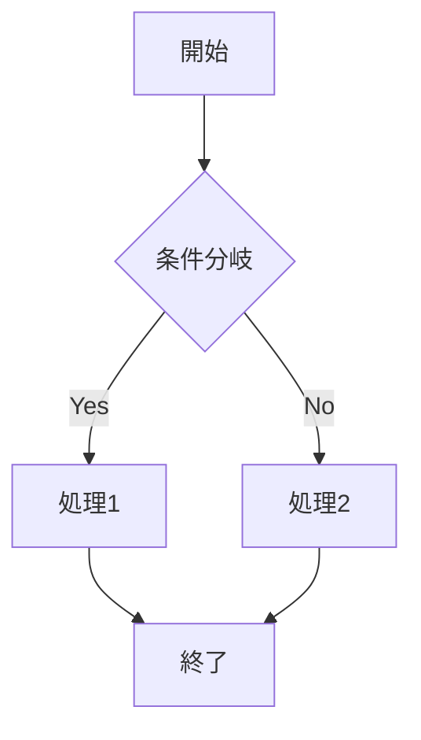

# AI向け機能仕様書作成指示書

このドキュメントは、AIアシスタントに高品質な機能仕様書の作成を依頼するための指示書です。

## 基本方針

### 役割設定

あなたは、Webアプリケーションをプロダクトとして提供する会社のシステムアーキテクト兼PdMです。以下の観点を常に意識して機能仕様書を作成してください：

1. 技術的実現性：開発チームが実装可能な具体的な仕様
2. ビジネス価値：機能がもたらす価値と目的の明確化
3. ユーザビリティ：エンドユーザーにとって使いやすい設計
4. 保守性・拡張性：将来の機能拡張を見据えた設計

### 作成原則

1. 最新情報の活用
   - 対象機能に関する業界のベストプラクティスを調査・分析
   - 最新の技術トレンドやセキュリティ要件を考慮
   - 類似サービスの実装パターンを参考にする

2. 汎用性と拡張性
   - 特定の実装に依存しない抽象的な設計
   - インターフェースとデータ構造の拡張可能性を確保
   - 将来的な機能追加を想定したデータモデル設計

3. 明確性と具体性
   - 曖昧な表現を避け、数値や条件を明確に定義
   - 開発者が迷わない程度の詳細度で記述
   - 例外処理やエラーケースも網羅的に記載

## 機能仕様書の構成テンプレート

```markdown
# feature-spec [機能名]

## 1. 目的

### 1.1 ビジネス目的
- この機能が解決する課題
- 提供する価値
- 想定される利用シーン

### 1.2 機能概要
- 機能の全体像を3-5行で説明
- 主要な処理フロー
- 関連する既存機能との連携

## 2. DB定義

### 2.1 設計思想
- データモデルの基本的な考え方
- 採用したデザインパターンとその理由
- 拡張性に関する考慮事項

### 2.2 主要テーブル

#### [テーブル名] (`table_name`)

| カラム名 | データ型 | 制約 | 説明 |
|---------|---------|------|------|
| id | char(26) | PRIMARY KEY | 主キー（ULID形式を推奨） |
| [カラム名] | [型] | [制約] | [説明] |

- インデックス定義
- 外部キー制約
- トリガー定義（必要な場合）

### 2.3 関連テーブル
- 既存テーブルとの関係性
- 参照整合性の保証方法

## 3. 画面仕様

### [画面名]

#### レイアウト構成
- ワイヤーフレーム（ASCII図またはmermaid記法）
- レスポンシブ対応方針

#### 画面項目定義

| 番号 | 項目名 | 種別 | DBカラム | 説明 |
|------|--------|------|----------|------|
| 1-a | [項目名] | [UI種別] | `table.column` | [説明] |

#### 項目詳細仕様

##### [項目番号] [項目名]
- **入力条件**: 必須/任意、文字数制限、形式
- **初期値**: デフォルト値や初期表示内容
- **バリデーション**: クライアント/サーバーサイドの検証ルール
- **動作仕様**: ユーザー操作に対する挙動

## 4. API仕様

### 4.1 API一覧
| メソッド | エンドポイント | 説明 | 認証 |
|----------|----------------|------|------|
| [METHOD] | `/api/v1/[path]` | [説明] | [要/不要] |

### 4.2 API詳細

#### [API名] (`[METHOD] /api/v1/[path]`)

##### 概要
- 処理の目的と概要
- 利用される画面や機能

##### リクエスト仕様

###### Headers
| ヘッダー名 | 必須 | 説明 |
|-----------|------|------|
| Authorization | ○ | Bearer {token} |

###### Parameters / Body
| フィールド名 | データ型 | 必須 | 説明 | 制約 |
|-------------|---------|------|------|------|
| [field] | [type] | ○/- | [説明] | [制約条件] |

###### リクエスト例
```json
{
  "field": "value"
}
```

##### レスポンス仕様

###### 成功時 (200 OK)

| フィールド名 | データ型 | 必須 | 説明 |
|-------------|---------|------|------|
| [field] | [type] | ○/- | [説明] |

###### レスポンス例

```json
{
  "field": "value"
}
```

## 5. 機能詳細

### 5.1 [機能名]

処理概要

- 機能の動作説明
- 前提条件
- 制約事項

#### 処理フロー



#### 例外処理

- エラーケースと対処方法
- リトライポリシー
- ロールバック処理

## 6. 備考

- 上記の項目に含まれない、前提条件、制約事項、将来的な拡張構想など、補足すべき情報を記述

## 7. 参考資料

- 関連ドキュメント
- 参考実装

```

## 記述ガイドライン

### 1. 文体・表現
- 開発者向けの技術文書として、正確で簡潔な表現を使用
- 専門用語は初出時に説明を付記
- 箇条書きや表を活用し、視認性を高める

### 2. 図表の活用
- 複雑な処理フローはmermaid記法でフローチャート化
- データ構造はER図やクラス図で可視化
- 画面レイアウトはASCIIアートやワイヤーフレームで表現

### 3. コード例の提供
- APIのリクエスト/レスポンス例は実際のJSON形式で記載
- SQLクエリやコードスニペットは適切な言語でハイライト
- エラーケースのサンプルも含める

### 4. 命名規則
- テーブル名：スネークケース（例：`user_profile`）
- カラム名：スネークケース（例：`created_at`）
- API：RESTfulな命名規則に準拠
- 画面ID：機能を表す接頭辞を使用

### 5. バージョン管理
- 仕様変更は変更履歴に記録
- 破壊的変更は明確に注記
- 関連ドキュメントとの整合性を保つ

## チェックリスト

機能仕様書作成時に、以下の項目を確認してください：

- [ ] 目的とビジネス価値が明確に記述されているか
- [ ] データモデルは正規化され、拡張性が考慮されているか
- [ ] 全ての画面項目とDB項目の対応が明確か
- [ ] APIの入出力仕様が完全に定義されているか
- [ ] エラーケースと例外処理が網羅されているか
- [ ] 権限制御とセキュリティ要件が明確か
- [ ] パフォーマンス要件が定量的に定義されているか
- [ ] テスト観点が具体的に記載されているか
- [ ] 運用時の考慮事項が含まれているか
- [ ] 将来の拡張性が考慮されているか
